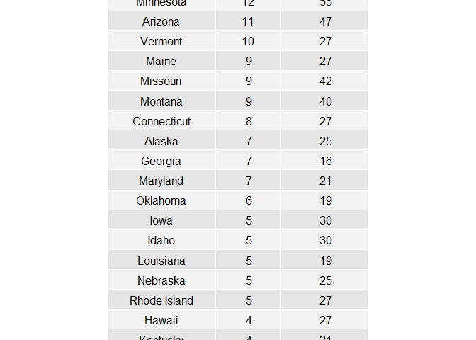
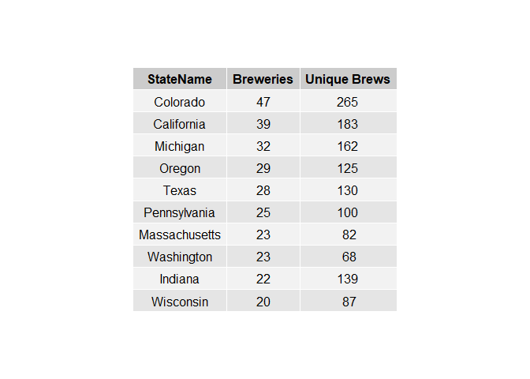
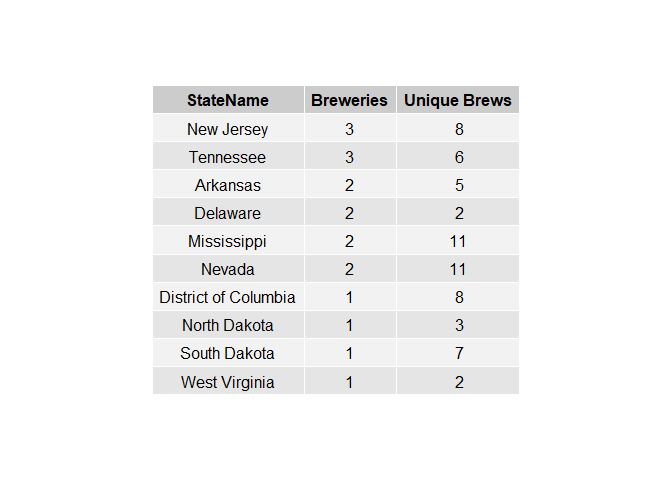
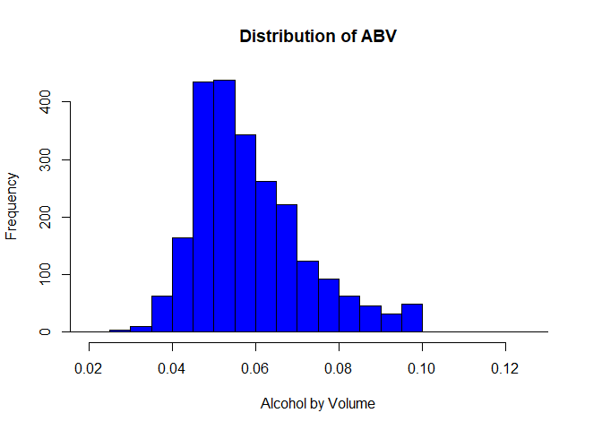
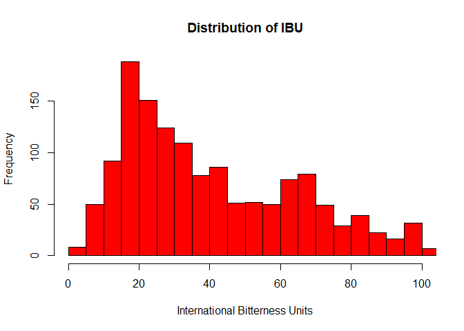
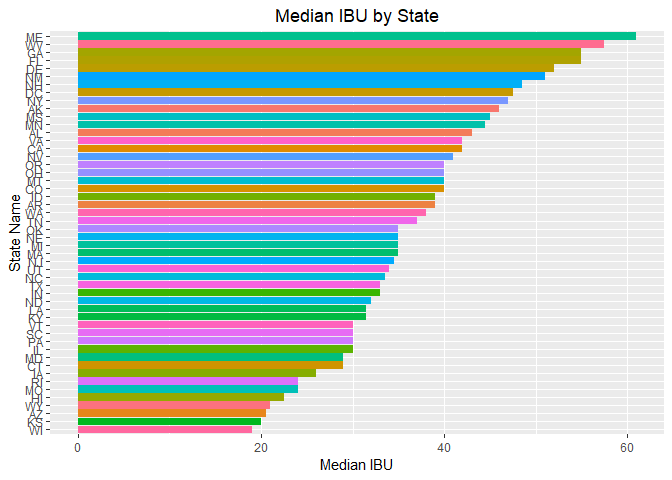
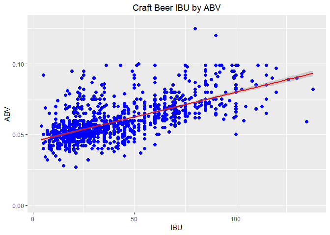
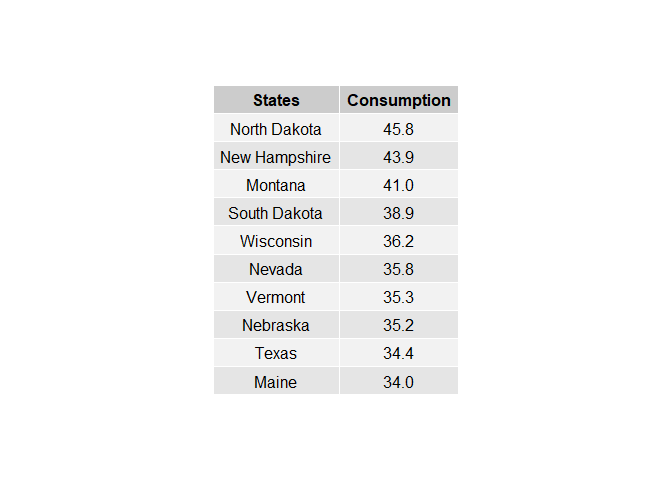
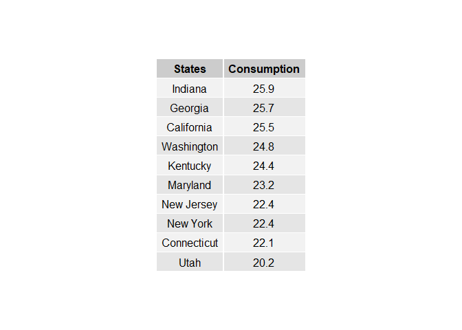

### XYZ Brewery Porposal
According to Fortune.com1: US Craft Brew industry is worth $26 billion dollars in 2017
This represents increases of 6.2 billion since 2015
The pace of growth is slowing but the opportunity is large
Craft beer drinkers tend to support local independent breweries
Consumers are becoming more selective
Rising demand for low alcohol by volume (ABV) and flavored beer
Each market share of .5% = $130 million in revenue

STEP 1: "Competitive Landscape" Evaluate current production of craft brews regionally
How many craft breweries are currently producing in the US?


```r
knitr::opts_chunk$set(echo = TRUE)
## obtain data needed to evaluate competitive landscape and load into R
getwd()
```

```
## [1] "C:/Users/jhold/Desktop/case study 1"
```

```r
setwd("c:/Users/jhold/Desktop/case study 1")
library(tidyverse)
```

```
## -- Attaching packages ---------------------------------------------------------------------------------------------------------------------------- tidyverse 1.2.1 --
```

```
## v ggplot2 3.1.0     v purrr   0.2.5
## v tibble  1.4.2     v dplyr   0.7.6
## v tidyr   0.8.1     v stringr 1.3.1
## v readr   1.1.1     v forcats 0.3.0
```

```
## -- Conflicts ------------------------------------------------------------------------------------------------------------------------------- tidyverse_conflicts() --
## x dplyr::filter() masks stats::filter()
## x dplyr::lag()    masks stats::lag()
```

```r
beers <- read_csv("c:/Users/jhold/Desktop/case study 1/Beers.csv")
```

```
## Parsed with column specification:
## cols(
##   Name = col_character(),
##   Beer_ID = col_integer(),
##   ABV = col_double(),
##   IBU = col_integer(),
##   Brewery_id = col_integer(),
##   Style = col_character(),
##   Ounces = col_double()
## )
```

```r
brewers <- read_csv("c:/Users/jhold/Desktop/case study 1/Breweries.csv")
```

```
## Parsed with column specification:
## cols(
##   Brew_ID = col_integer(),
##   Name = col_character(),
##   City = col_character(),
##   State = col_character()
## )
```

```r
#check content of files before analysis
str(beers)
```

```
## Classes 'tbl_df', 'tbl' and 'data.frame':	2410 obs. of  7 variables:
##  $ Name      : chr  "Pub Beer" "Devil's Cup" "Rise of the Phoenix" "Sinister" ...
##  $ Beer_ID   : int  1436 2265 2264 2263 2262 2261 2260 2259 2258 2131 ...
##  $ ABV       : num  0.05 0.066 0.071 0.09 0.075 0.077 0.045 0.065 0.055 0.086 ...
##  $ IBU       : int  NA NA NA NA NA NA NA NA NA NA ...
##  $ Brewery_id: int  409 178 178 178 178 178 178 178 178 178 ...
##  $ Style     : chr  "American Pale Lager" "American Pale Ale (APA)" "American IPA" "American Double / Imperial IPA" ...
##  $ Ounces    : num  12 12 12 12 12 12 12 12 12 12 ...
##  - attr(*, "spec")=List of 2
##   ..$ cols   :List of 7
##   .. ..$ Name      : list()
##   .. .. ..- attr(*, "class")= chr  "collector_character" "collector"
##   .. ..$ Beer_ID   : list()
##   .. .. ..- attr(*, "class")= chr  "collector_integer" "collector"
##   .. ..$ ABV       : list()
##   .. .. ..- attr(*, "class")= chr  "collector_double" "collector"
##   .. ..$ IBU       : list()
##   .. .. ..- attr(*, "class")= chr  "collector_integer" "collector"
##   .. ..$ Brewery_id: list()
##   .. .. ..- attr(*, "class")= chr  "collector_integer" "collector"
##   .. ..$ Style     : list()
##   .. .. ..- attr(*, "class")= chr  "collector_character" "collector"
##   .. ..$ Ounces    : list()
##   .. .. ..- attr(*, "class")= chr  "collector_double" "collector"
##   ..$ default: list()
##   .. ..- attr(*, "class")= chr  "collector_guess" "collector"
##   ..- attr(*, "class")= chr "col_spec"
```

```r
str(brewers)
```

```
## Classes 'tbl_df', 'tbl' and 'data.frame':	558 obs. of  4 variables:
##  $ Brew_ID: int  1 2 3 4 5 6 7 8 9 10 ...
##  $ Name   : chr  "NorthGate Brewing" "Against the Grain Brewery" "Jack's Abby Craft Lagers" "Mike Hess Brewing Company" ...
##  $ City   : chr  "Minneapolis" "Louisville" "Framingham" "San Diego" ...
##  $ State  : chr  "MN" "KY" "MA" "CA" ...
##  - attr(*, "spec")=List of 2
##   ..$ cols   :List of 4
##   .. ..$ Brew_ID: list()
##   .. .. ..- attr(*, "class")= chr  "collector_integer" "collector"
##   .. ..$ Name   : list()
##   .. .. ..- attr(*, "class")= chr  "collector_character" "collector"
##   .. ..$ City   : list()
##   .. .. ..- attr(*, "class")= chr  "collector_character" "collector"
##   .. ..$ State  : list()
##   .. .. ..- attr(*, "class")= chr  "collector_character" "collector"
##   ..$ default: list()
##   .. ..- attr(*, "class")= chr  "collector_guess" "collector"
##   ..- attr(*, "class")= chr "col_spec"
```

```r
# How many breweries are in the US
length(brewers$State)
```

```
## [1] 558
```
### Combine multiple data sources to provide richer understanding of craft brewering in US
Check integrity of data files
evaluate missing data


```r
knitr::opts_chunk$set(echo = TRUE)
# fully analyze data by combining different data sets
Brewtot <- merge(beers, brewers, by.x = "Brewery_id", by.y = "Brew_ID")
# check integrity of combined files and evaluate variable features
head(Brewtot,6)
```

```
##   Brewery_id        Name.x Beer_ID   ABV IBU
## 1          1  Get Together    2692 0.045  50
## 2          1 Maggie's Leap    2691 0.049  26
## 3          1    Wall's End    2690 0.048  19
## 4          1       Pumpion    2689 0.060  38
## 5          1    Stronghold    2688 0.060  25
## 6          1   Parapet ESB    2687 0.056  47
##                                 Style Ounces            Name.y        City
## 1                        American IPA     16 NorthGate Brewing Minneapolis
## 2                  Milk / Sweet Stout     16 NorthGate Brewing Minneapolis
## 3                   English Brown Ale     16 NorthGate Brewing Minneapolis
## 4                         Pumpkin Ale     16 NorthGate Brewing Minneapolis
## 5                     American Porter     16 NorthGate Brewing Minneapolis
## 6 Extra Special / Strong Bitter (ESB)     16 NorthGate Brewing Minneapolis
##   State
## 1    MN
## 2    MN
## 3    MN
## 4    MN
## 5    MN
## 6    MN
```

```r
tail(Brewtot,6)
```

```
##      Brewery_id                    Name.x Beer_ID   ABV IBU
## 2405        556             Pilsner Ukiah      98 0.055  NA
## 2406        557  Heinnieweisse Weissebier      52 0.049  NA
## 2407        557           Snapperhead IPA      51 0.068  NA
## 2408        557         Moo Thunder Stout      50 0.049  NA
## 2409        557         Porkslap Pale Ale      49 0.043  NA
## 2410        558 Urban Wilderness Pale Ale      30 0.049  NA
##                        Style Ounces                        Name.y
## 2405         German Pilsener     12         Ukiah Brewing Company
## 2406              Hefeweizen     12       Butternuts Beer and Ale
## 2407            American IPA     12       Butternuts Beer and Ale
## 2408      Milk / Sweet Stout     12       Butternuts Beer and Ale
## 2409 American Pale Ale (APA)     12       Butternuts Beer and Ale
## 2410        English Pale Ale     12 Sleeping Lady Brewing Company
##               City State
## 2405         Ukiah    CA
## 2406 Garrattsville    NY
## 2407 Garrattsville    NY
## 2408 Garrattsville    NY
## 2409 Garrattsville    NY
## 2410     Anchorage    AK
```

```r
str(Brewtot)
```

```
## 'data.frame':	2410 obs. of  10 variables:
##  $ Brewery_id: int  1 1 1 1 1 1 2 2 2 2 ...
##  $ Name.x    : chr  "Get Together" "Maggie's Leap" "Wall's End" "Pumpion" ...
##  $ Beer_ID   : int  2692 2691 2690 2689 2688 2687 2686 2685 2684 2683 ...
##  $ ABV       : num  0.045 0.049 0.048 0.06 0.06 0.056 0.08 0.125 0.077 0.042 ...
##  $ IBU       : int  50 26 19 38 25 47 68 80 25 42 ...
##  $ Style     : chr  "American IPA" "Milk / Sweet Stout" "English Brown Ale" "Pumpkin Ale" ...
##  $ Ounces    : num  16 16 16 16 16 16 16 16 16 16 ...
##  $ Name.y    : chr  "NorthGate Brewing" "NorthGate Brewing" "NorthGate Brewing" "NorthGate Brewing" ...
##  $ City      : chr  "Minneapolis" "Minneapolis" "Minneapolis" "Minneapolis" ...
##  $ State     : chr  "MN" "MN" "MN" "MN" ...
```

```r
### Determine market saturation by state for breweries and beers brewed
library(plyr)
```

```
## -------------------------------------------------------------------------
```

```
## You have loaded plyr after dplyr - this is likely to cause problems.
## If you need functions from both plyr and dplyr, please load plyr first, then dplyr:
## library(plyr); library(dplyr)
```

```
## -------------------------------------------------------------------------
```

```
## 
## Attaching package: 'plyr'
```

```
## The following objects are masked from 'package:dplyr':
## 
##     arrange, count, desc, failwith, id, mutate, rename, summarise,
##     summarize
```

```
## The following object is masked from 'package:purrr':
## 
##     compact
```

```r
BrewersbyState <- brewers$State
CntState <- count(brewers$State)
cntbeers <- count(Brewtot$State)
df <- merge(CntState,cntbeers, by.x ='x', by.y='x')
names(df) <- c("State", "Breweries", "Unique Brews")
library (openintro)
```

```
## Please visit openintro.org for free statistics materials
```

```
## 
## Attaching package: 'openintro'
```

```
## The following object is masked from 'package:ggplot2':
## 
##     diamonds
```

```
## The following objects are masked from 'package:datasets':
## 
##     cars, trees
```

```r
library(gridExtra)
```

```
## 
## Attaching package: 'gridExtra'
```

```
## The following object is masked from 'package:dplyr':
## 
##     combine
```

```r
library(grid)
df$StateName <- abbr2state(df$State) 
df <- df[order(-df$Breweries),] 
dft <- df[,c(4,2,3)]
grid.table(dft,rows = NULL)
```

<!-- -->
### Tables must be separately generated

```r
knitr::opts_chunk$set(echo = TRUE)

dfh <-df[1:10,c(4,2,3)]
grid.table(dfh,rows = NULL)
```

<!-- -->


```r
knitr::opts_chunk$set(echo = TRUE)
dfl <-df[42:51,c(4,2,3)]  
grid.table(dfl,rows=NULL)
```

<!-- -->

# Evaluate for missing data points


```r
knitr::opts_chunk$set(echo = TRUE)

MissTot <- sapply(Brewtot, function(x) sum(is.na(x)))
MissTot
```

```
## Brewery_id     Name.x    Beer_ID        ABV        IBU      Style 
##          0          0          0         62       1005          5 
##     Ounces     Name.y       City      State 
##          0          0          0          0
```

```r
# IBU's have a high rate of missing data which may effect analyses of these data points
```

## Summary of Brewery data
The Top 5 States for number of breweries are:
Colorado = 42,  California=  39, Michigan= 32, Oregon= 29, Texas= 28
States with only 1 craft brewery are:
District of Columbia, North Dakota, South Dakota, and West Virginia
There are 2410 unique craft beers brewed across the US
The Top 5 States for number of unique beers brewed are:
Colorado= 265, California= 183, Michigan= 162, Indiana=139, Texas= 130
The lowest 5 States for number of unique beers brewed are:
Tennessee= 6, Arizona=5, North Dakota=3, Delaware=2, West Virginia=2


## Are there regional differences in beer characteristics
Median Alcohol by Volume (ABV) and median International Bitterness Unit (IBU) inform about the average characteristics of craft beers
What is the distribution of ABV and IBU and what does that tell us about beer brewing in the US market
What is the median ABV for each state?
What is the median IBU for each state?


```r
knitr::opts_chunk$set(echo = TRUE)

MedA<- aggregate (Brewtot$ABV, list(Brewtot$State), median, na.rm=TRUE)
MedI <- aggregate (Brewtot$IBU, list(Brewtot$State), median, na.rm=TRUE)

MedA
```

```
##    Group.1      x
## 1       AK 0.0560
## 2       AL 0.0600
## 3       AR 0.0520
## 4       AZ 0.0550
## 5       CA 0.0580
## 6       CO 0.0605
## 7       CT 0.0600
## 8       DC 0.0625
## 9       DE 0.0550
## 10      FL 0.0570
## 11      GA 0.0550
## 12      HI 0.0540
## 13      IA 0.0555
## 14      ID 0.0565
## 15      IL 0.0580
## 16      IN 0.0580
## 17      KS 0.0500
## 18      KY 0.0625
## 19      LA 0.0520
## 20      MA 0.0540
## 21      MD 0.0580
## 22      ME 0.0510
## 23      MI 0.0620
## 24      MN 0.0560
## 25      MO 0.0520
## 26      MS 0.0580
## 27      MT 0.0550
## 28      NC 0.0570
## 29      ND 0.0500
## 30      NE 0.0560
## 31      NH 0.0550
## 32      NJ 0.0460
## 33      NM 0.0620
## 34      NV 0.0600
## 35      NY 0.0550
## 36      OH 0.0580
## 37      OK 0.0600
## 38      OR 0.0560
## 39      PA 0.0570
## 40      RI 0.0550
## 41      SC 0.0550
## 42      SD 0.0600
## 43      TN 0.0570
## 44      TX 0.0550
## 45      UT 0.0400
## 46      VA 0.0565
## 47      VT 0.0550
## 48      WA 0.0555
## 49      WI 0.0520
## 50      WV 0.0620
## 51      WY 0.0500
```

```r
MedI
```

```
##    Group.1    x
## 1       AK 46.0
## 2       AL 43.0
## 3       AR 39.0
## 4       AZ 20.5
## 5       CA 42.0
## 6       CO 40.0
## 7       CT 29.0
## 8       DC 47.5
## 9       DE 52.0
## 10      FL 55.0
## 11      GA 55.0
## 12      HI 22.5
## 13      IA 26.0
## 14      ID 39.0
## 15      IL 30.0
## 16      IN 33.0
## 17      KS 20.0
## 18      KY 31.5
## 19      LA 31.5
## 20      MA 35.0
## 21      MD 29.0
## 22      ME 61.0
## 23      MI 35.0
## 24      MN 44.5
## 25      MO 24.0
## 26      MS 45.0
## 27      MT 40.0
## 28      NC 33.5
## 29      ND 32.0
## 30      NE 35.0
## 31      NH 48.5
## 32      NJ 34.5
## 33      NM 51.0
## 34      NV 41.0
## 35      NY 47.0
## 36      OH 40.0
## 37      OK 35.0
## 38      OR 40.0
## 39      PA 30.0
## 40      RI 24.0
## 41      SC 30.0
## 42      SD   NA
## 43      TN 37.0
## 44      TX 33.0
## 45      UT 34.0
## 46      VA 42.0
## 47      VT 30.0
## 48      WA 38.0
## 49      WI 19.0
## 50      WV 57.5
## 51      WY 21.0
```

```r
#### South Dakota is missing IBU data and will be dropped as a data point
MedI <- MedI[-c(42),]
## evaluate the frequency distributions of ABV and IBU 
hist(Brewtot$ABV, main="Distribution of ABV", breaks=20, xlab="Alcohol by Volume", border="black", col="blue", xlim=c(.02,.13)) 
```

<!-- -->

```r
hist(Brewtot$IBU, main="Distribution of IBU", breaks=20, xlab="International Bitterness Units", border="black", col="red", xlim=c(0,100))
```

<!-- -->

```r
## Both ABV and IBU's are positively skewed. Most brews have a low to moderate IBU and ABV while a subset of Beers are high in ABV and/or IBU
## Evaluate beer characteristics by state to determine if thwere any regional effects to consider
ggplot(data=MedA, aes(x=reorder(Group.1, x), y=x, fill=Group.1)) +geom_bar(stat="identity") +coord_flip() +ylab("Median ABV") + xlab("State Name") +ggtitle("Median ABV by State")+ theme(plot.title = element_text(hjust = 0.5)) + theme(legend.position="none")
```

<!-- -->

```r
ggplot(data=MedI, aes(x=reorder(Group.1, x), y=x, fill=Group.1)) +geom_bar(stat="identity") +coord_flip() +ylab("Median IBU") + xlab("State Name") +ggtitle("Median IBU by State")+ theme(plot.title = element_text(hjust = 0.5)) + theme(legend.position="none")
```

<!-- -->

```r
## Evaluate alcohol level
Brewtot <- Brewtot[order(-Brewtot$ABV),] 
##Most alcohol by volume beer is Colorado
head(Brewtot,1)
```

```
##     Brewery_id                                               Name.x
## 375         52 Lee Hill Series Vol. 5 - Belgian Style Quadrupel Ale
##     Beer_ID   ABV IBU            Style Ounces                  Name.y
## 375    2565 0.128  NA Quadrupel (Quad)   19.2 Upslope Brewing Company
##        City State
## 375 Boulder    CO
```

```r
## highest 5 and lowest 5 state median abv's
MedA <- MedA[order(-MedA$x),] 
names(MedA) <- c("State", "ABV")
head(MedA,5)
```

```
##    State    ABV
## 8     DC 0.0625
## 18    KY 0.0625
## 23    MI 0.0620
## 33    NM 0.0620
## 50    WV 0.0620
```

```r
tail(MedA,5)
```

```
##    State   ABV
## 17    KS 0.050
## 29    ND 0.050
## 51    WY 0.050
## 32    NJ 0.046
## 45    UT 0.040
```

```r
## basic statistics for ABV use pastecs for standard deviation and to check standard error of the mean
library(pastecs)
```

```
## 
## Attaching package: 'pastecs'
```

```
## The following objects are masked from 'package:dplyr':
## 
##     first, last
```

```
## The following object is masked from 'package:tidyr':
## 
##     extract
```

```r
options(scipen=100)
stat.desc(Brewtot$ABV)
```

```
##         nbr.val        nbr.null          nbr.na             min 
## 2348.0000000000    0.0000000000   62.0000000000    0.0010000000 
##             max           range             sum          median 
##    0.1280000000    0.1270000000  140.3480000000    0.0560000000 
##            mean         SE.mean    CI.mean.0.95             var 
##    0.0597734242    0.0002794636    0.0005480212    0.0001833786 
##         std.dev        coef.var 
##    0.0135417337    0.2265510785
```

```r
### Evaluate IBU level
Brewtot <- Brewtot[order(-Brewtot$IBU),] 
## Most bitter beer by IBU is brewed in 
head(Brewtot,1)
```

```
##      Brewery_id                    Name.x Beer_ID   ABV IBU
## 1857        375 Bitter Bitch Imperial IPA     980 0.082 138
##                               Style Ounces                  Name.y    City
## 1857 American Double / Imperial IPA     12 Astoria Brewing Company Astoria
##      State
## 1857    OR
```

```r
## highest 5 and lowest 5 state median IBU's
MedI <- MedI[order(-MedI$x),] 
names(MedI) <- c("State", "IBU")
head(MedI,5)
```

```
##    State  IBU
## 22    ME 61.0
## 50    WV 57.5
## 10    FL 55.0
## 11    GA 55.0
## 9     DE 52.0
```

```r
tail(MedI,5)
```

```
##    State  IBU
## 12    HI 22.5
## 51    WY 21.0
## 4     AZ 20.5
## 17    KS 20.0
## 49    WI 19.0
```

```r
stat.desc(Brewtot$IBU)
```

```
##       nbr.val      nbr.null        nbr.na           min           max 
##  1405.0000000     0.0000000  1005.0000000     4.0000000   138.0000000 
##         range           sum        median          mean       SE.mean 
##   134.0000000 60012.0000000    35.0000000    42.7131673     0.6924162 
##  CI.mean.0.95           var       std.dev      coef.var 
##     1.3582818   673.6135373    25.9540659     0.6076362
```

Note that the `echo = FALSE` parameter was added to the code chunk to prevent printing of the R code that generated the plot.


#### Beer Characteristcs overall and by State
### ABV Data
Highest ABV reported = .128 
Lee Hill Series Vol. 5 - Belgian Style Quadrupel, Upslope Brewing Company      Boulder, CO
Overall ABV Characteristics
Mean= 0.0598, Median=.056, Standard Deviation=0135
States with Highest Average (median) ABV:
District of Columbia=.0625, Kentucky=.0625, Michigan=.062,
   New Mexico=.62, and West Virginia=.62
States with Lowest Average (median) ABV:
Kansas=.05, North Dakota=.05, Wyoming=.05, New Jersey=.046, and Utah=.04

### IBU Data
Highest IBU reported = 138 
Bitter Bitch Imperial IPA, American Double / Imperial IPA, Astoria Brewing Company Astoria, OR
Mean=42.7, Median=35.0, Standard Deviation=25.9
States with Highest Average (median) IBU:
Maine=61.0, West Virginia=57.5, Florida=55.0, Georgia=55.0, Delaware=52.0
States with Lowest Average (median) IBU:
Hawaii=22.5, Wyoming=21.0, Arizona=20.5, Kansas=20.0, and Wisconsin=19.0


#### what is the relationship between ABV and IBU


```r
knitr::opts_chunk$set(echo = TRUE)

### plot of ABV by IBU
ggplot(data=Brewtot, aes(x=IBU, y=ABV)) +geom_point(shape = 16, size = 2, color="blue") + stat_smooth(method = 'lm', color='red') + labs(title = 'Craft Beer IBU by ABV') + theme(plot.title = element_text(hjust = 0.5))
```

```
## Warning: Removed 1005 rows containing non-finite values (stat_smooth).
```

```
## Warning: Removed 1005 rows containing missing values (geom_point).
```

<!-- -->

```r
### correlation test of limear relationship
cor.test( ~ ABV + IBU,data=Brewtot,method = "pearson")
```

```
## 
## 	Pearson's product-moment correlation
## 
## data:  ABV and IBU
## t = 33.863, df = 1403, p-value < 0.00000000000000022
## alternative hypothesis: true correlation is not equal to 0
## 95 percent confidence interval:
##  0.6407982 0.6984238
## sample estimates:
##       cor 
## 0.6706215
```


#### Plot of IBU versus ABV
Shows a general positive trend with higher Abv associated with higher levels of IBU
The regression line illustrates that the variability may be changing along the prediction line (heteroscedasticity)
    This is exemplified by the fact that beers of 5% ABV or lower tend to have low to moderate IBU and not high levels of IBU
    However, at ABV of 7.5 and higher, you get a full range of IBU's meaning that it is possible to have high ABV low IBU beers
    Note: this coreelation does not show causation as the relationship may be affect by third variables such as ingredients used, 
     fermentaiton process, and marketing needs
     
### Data regarding consumption is helpful to make business plans
additional data was scraped from URL=http://scottjanish.com/map-per-capita-gallons-beer-consumed-per-adult-state


```r
knitr::opts_chunk$set(echo = TRUE)
### scraping web data on consumption
library(XML)
library(rvest)
```

```
## Loading required package: xml2
```

```
## 
## Attaching package: 'rvest'
```

```
## The following object is masked from 'package:XML':
## 
##     xml
```

```
## The following object is masked from 'package:purrr':
## 
##     pluck
```

```
## The following object is masked from 'package:readr':
## 
##     guess_encoding
```

```r
dr1=html('http://scottjanish.com/map-per-capita-gallons-beer-consumed-per-adult-state')
```

```
## Warning: 'html' is deprecated.
## Use 'read_html' instead.
## See help("Deprecated")
```

```r
drinks  <- dr1 %>%  html_nodes("td") %>% html_text()
str(drinks)
```

```
##  chr [1:102] "Alabama" "30.2" "Alaska" "28.7" "Arizona" "29.5" ...
```

```r
x <- seq(1,101,2)
States <- drinks[x]
y <- seq(2,102,2)
Consumption <- as.numeric(drinks[y])
dr2<-dplyr::data_frame(States,Consumption)
str(dr2)
```

```
## Classes 'tbl_df', 'tbl' and 'data.frame':	51 obs. of  2 variables:
##  $ States     : chr  "Alabama" "Alaska" "Arizona" "Arkansas" ...
##  $ Consumption: num  30.2 28.7 29.5 26.7 25.5 30 22.1 33.6 28.3 27.4 ...
```

```r
dr2$State <- state2abbr(dr2$States) 
dr2 <- dr2[order(-dr2$Consumption),] 
head(dr2)
```

```
## # A tibble: 6 x 3
##   States        Consumption State
##   <chr>               <dbl> <chr>
## 1 North Dakota         45.8 ND   
## 2 New Hampshire        43.9 NH   
## 3 Montana              41   MT   
## 4 South Dakota         38.9 SD   
## 5 Wisconsin            36.2 WI   
## 6 Nevada               35.8 NV
```

```r
tail(dr2)
```

```
## # A tibble: 6 x 3
##   States      Consumption State
##   <chr>             <dbl> <chr>
## 1 Kentucky           24.4 KY   
## 2 Maryland           23.2 MD   
## 3 New Jersey         22.4 NJ   
## 4 New York           22.4 NY   
## 5 Connecticut        22.1 CT   
## 6 Utah               20.2 UT
```

```r
drh <- dr2[1:10,c(1,2)]
drl <- dr2[42:51,c(1,2)]
```

#### Regions with higher consumption rates fall in the least saturated category (ND,SD)
Montana is regionally close. 
Competition from Colorado & Wisconsin


```r
knitr::opts_chunk$set(echo = TRUE)
grid.table(drh,rows = NULL)
```

<!-- -->
#### Consumption in gallons per adult

```r
knitr::opts_chunk$set(echo = TRUE)
grid.table(drl,rows=NULL)
```

<!-- -->
#### Consumption in gallons per adult
